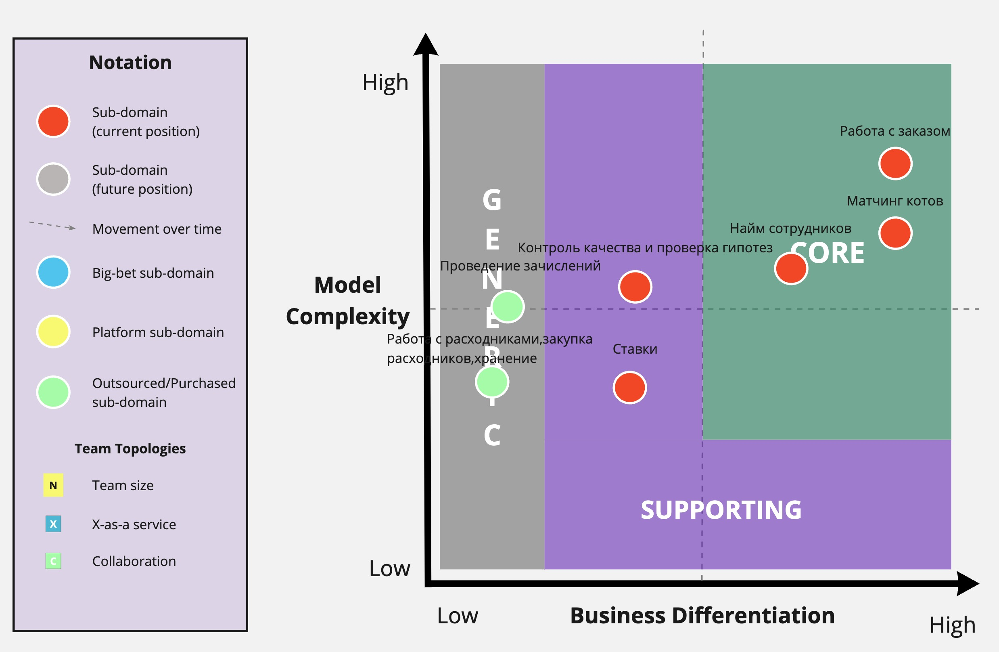
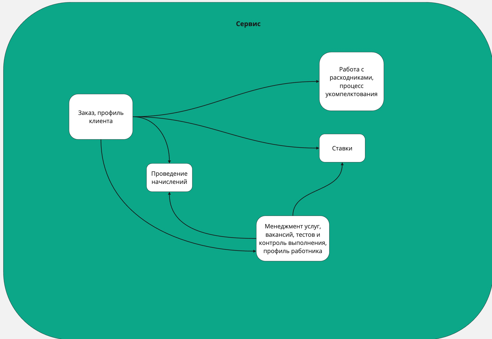
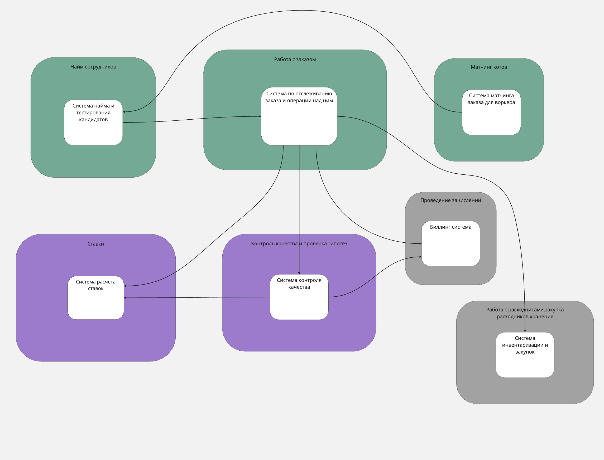
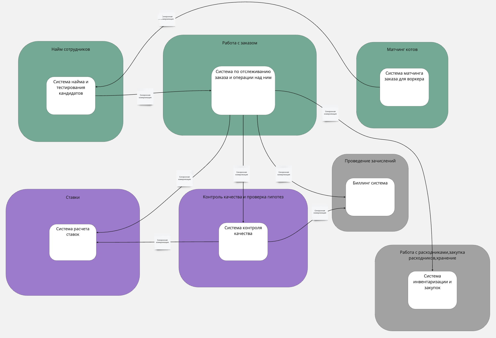

# Анализ систем

**Ссылка на [схемы](https://miro.com/app/board/uXjVK6sg_Jk=/?share_link_id=426027506670).**

**Суб-домены и их типы**

<table>
  <tr>
   <td>Вид поддомена
   </td>
   <td>Конкурентное преимущество
   </td>
   <td>Сложность доменной модели
   </td>
   <td>Изменчивость
   </td>
   <td>Варианты реализации
   </td>
   <td>Интерес проблемы
   </td>
   <td>Предполагаемый вид поддомена
   </td>
  </tr>
  <tr>
   <td>Матчинг котов
   </td>
   <td>Да
   </td>
   <td>Высокая
   </td>
   <td>Высокая
   </td>
   <td>Инхаус
   </td>
   <td>Высокий
   </td>
   <td>core
   </td>
  </tr>
  <tr>
   <td>Работа с расходниками,закупка расходников,хранение
   </td>
   <td>Нет
   </td>
   <td>Высокая
   </td>
   <td>Низкая
   </td>
   <td>Инхаус+аутсорс
   </td>
   <td>Низкий
   </td>
   <td>generic
   </td>
  </tr>
  <tr>
   <td>Найм сотрудников
   </td>
   <td>Да
   </td>
   <td>Высокая
   </td>
   <td>Средняя
   </td>
   <td>Инхаус
   </td>
   <td>Высокий
   </td>
   <td>core
   </td>
  </tr>
  <tr>
   <td>Ставки
   </td>
   <td>Нет
   </td>
   <td>Низкая
   </td>
   <td>Высокая
   </td>
   <td>Инхаус
   </td>
   <td>Низкий
   </td>
   <td>supporting
   </td>
  </tr>
  <tr>
   <td>Работа с заказом
   </td>
   <td>Нет
   </td>
   <td>Высокая
   </td>
   <td>Высокая
   </td>
   <td>Инхаус
   </td>
   <td>Высокий
   </td>
   <td>сore
   </td>
  </tr>
  <tr>
   <td>Проведение зачислений
   </td>
   <td>Нет
   </td>
   <td>Низкая
   </td>
   <td>Низкая
   </td>
   <td>Отусорс+Инхаус
   </td>
   <td>Низкий
   </td>
   <td>generic
   </td>
  </tr>
  <tr>
   <td>Контроль качества и проверка гипотез
   </td>
   <td>Да
   </td>
   <td>Низкая
   </td>
   <td>Высокая
   </td>
   <td>Инхаус
   </td>
   <td>Высокий
   </td>
   <td>supporting
   </td>
  </tr>
</table>

**Логика выбора поддоменов и их типов**

* Матчинг котов. Данный субдомен был выбран исходя из принципа конкурентного преимущества для компании. Предполагается, что, непосредственно, матчинг и будет одним из конкурентным преимуществом при выборе данного сервиса. Также данный сервис в дальнейшем будет часто меняться, для проверки разных алгоритмов матчинга, АБ тестирования и так далее. Исходя их всего вышеперечисленного выделил данную область как отдельный субдомен с типом core. У субдомена весьма критичная метрика для всего бизнеса, ведь без алгоритма подбора не будет функционировать главная бизнес составляющая сервиса.
* Работа с расходниками,закупка расходников,хранение. Данный субдомен был выделен по принципу объединения подразделения склад расходников и все операции вокруг него, а именно: закупка, хранение, транспортировка. Кажется, что данный домен не несет в себе определенного конкурентного преимущества и мало подвержен изменениям. Для данного домена выбран тип generic, потому как данный тип сервиса общий для похожих компаний и его можно отдать на аутсорс или заменит внешней системой трекинга для склада.
* Найм сотрудников. Данная область выделена в субдомен, потому как, бизнес область как найм сотрудника является весьма распространенной и в случае MCF несет весьма важное значение для компании. Изначально было желание выделить данный субдомен как supporting, но перечитав требования, а именно пункты “Для бизнеса критично проверять новые гипотезы по отсеву котов и изменять уже существующие с максимальной скоростью и надежностью” и “US-080] Для устройства котом в штат MCF, коту необходимо оставить заявку на сайте, после чего с котом связывается менеджер и назначает набор тестов, который оценит уровень потенциального кандидата. Это делается, чтобы компания была уверена, что кот входит в 3% лучших котов мира”, я пришел к выводу что данный домен содержит в себе непосредственное конкурентное преимущество для компании, а именно штат из высококвалифицированных воркеров, которые зачисляются в штат путем системы тестирования, которая в свою очередь изменяется и дополняется на основе гипотез. Гипотезы в свою очередь вырабатываются непосредственно отделом контроля качества. Исходя из этого для субдомена был выбран тип core.
* Ставки. Выделил данную область как субдомен. Исходя из описания, видно, что данный функционал не критичен для бизнеса и не играет основную роль, но так же можно заметить, что это весьма нестандартный и самобытный функционал, который может меняться в дальнейшем. Исходя из этого выделил его в тип supporting.
* Работа с заказом. Я предположил, что работу с заказом можно выделить в отдельный субдомен исходя из того, что это процесс состоящий из множества этапов. Это весьма практичный и уникальный для компании функционал, который сложно отдать на аутсорс или заменить чем-то готовым. Данный функционал несет несомненное конкурентное преимущество и, определенно, будет часто меняться. Данный субдомен выделен в core часть.
* Проведение зачислений. Функционал платежей и биллинга весьма общий для разных компаний, так и для MCF я выделил его в отдельный субдомен с типом generic.
* Контроль качества и проверка гипотез. Данный функционал не является критическим для бизнеса, но мне показалось, что данный поддомен можно выделить как отдельную бизнес часть. Кажется, что в будущем, у данного домена есть потенциал роста и изменения. Выделен как тип supporting.

Core domain chart

**Деление на боундед-контексты**

Были выделены следующие боундед-контексты.

<table>
  <tr>
   <td><strong>Вид поддомена</strong>
   </td>
   <td><strong>Выделенный боундед-контекст</strong>
   </td>
  </tr>
  <tr>
   <td>Матчинг
   </td>
   <td>Система матчинга заказа для воркера
   </td>
  </tr>
  <tr>
   <td>Работа с расходниками,закупка расходников,хранение
   </td>
   <td>Система инвентаризации и закупок
   </td>
  </tr>
  <tr>
   <td>Найм сотрудников
   </td>
   <td>Система найма и тестирования кандидатов
   </td>
  </tr>
  <tr>
   <td>Ставки
   </td>
   <td>Система расчета ставок
   </td>
  </tr>
  <tr>
   <td>Работа с заказом
   </td>
   <td>Система по отслеживанию заказа и операции над ним, Система администрирования услуг.
   </td>
  </tr>
  <tr>
   <td>Проведение зачислений
   </td>
   <td>Биллинг система
   </td>
  </tr>
  <tr>
   <td>Контроль качества и проверка гипотез
   </td>
   <td>Система контроля качества
   </td>
  </tr>
</table>

Как видно, исходя из таблицы, для субдомена “Работа с заказом” было выделено два контекста, над которыми будет работать одна команда.

Приведем пример финальной схемы первой итерации.

А также предварительную версию с боундед-контектсами.

Исходя из анализа двух схем, можно заметить, что найм сотрудника выделяется как отдельный суб-домен. На мой взгляд на это есть причина - а именно то, что сам по себе найм и HR вполне ложится в отдельную бизнес единицу и будет развиваться параллельно с основным продуктом со своим жизненным циклом. Если смотреть на 1 вариант разделение по ES, видно что сама логика разделения строилась больше на процессе найма и тестирования кандидатов, поэтому не была выделена как отдельная область.

Матчинг был выделен в отдельный суб-добмен. Исходя из требований к системе - матчинг является критическим и конкурентным функционалом MCF, поэтому я посчитал уместным выделить его в отдельный суб-домен. В первой итерации она рассматривался больше как процесс, поэтому был един с процессом выполнения заказа.

Контроль качества и проверка гипотез. Выделен в отдельный суб-домен. Я исходил из того, что отдел контроля качества весьма распространенная бизнес единица в разного рода бизнесах, поэтому решил выделить его в отдельный домен.

**Характеристики проекта**

Исходя из анализа ТЗ были выделены следующие характеристики

1. Исходя из общих пожеланий бизнеса, а именно “Бизнесу необходим низкий ТТМ (Time To Market), чтобы конкурировать на рынке”, можно заключить, что для сервисов будут важны такие характеристики как: **agility, testability и deployability.**
2. “Общая нагрузка на систему не будет превышать 10 заказов в день и 100 клиентов. Воркеров будет около 20 котов”. Из этого пожелания можно сделать вывод, что сервис заказов будет мало нагружен.
3. “Для бизнеса критично проверять новые гипотезы по отсеву котов и изменять уже существующие с максимальной скоростью и надёжностью.” Данное требования говорит о том, что бизнесу важно понимать как выполняются заказы и улучшать систему найма на основе анализа выполненных и проваленных заказов. Следовательно можно выделить такие характеристики как : **modifiability и evolvability.**
4. “Деньги на данный момент не критичны, happy cat box готовы потратить столько, сколько потребуется. Команда разработки будет собрана после нашего анализа требуемой системы”. Можно сделать вывод, что бюджет выделяется достаточный и явных озвученных ограничений нет.
5. [US-081] “Мы ожидаем 1к заявок в день от рандомных котов, также, судя по отзывам, наши конкуренты могут попытаться нас заддосить в этом месте. Они так делали уже несколько раз с другими компаниями, после чего компании закрывались с позором.” Можно сделать вывод, что модуль найма должен быть готов к ддос атакам и высокой нагрузке, следовательно важные такие характеристики как: **availability и scalability, maintainability.**

Исходя из полученных характеристик системы больше всего подходят два стиля, а именно: Service-based architecture style и Microservices architecture style. Изначально я для системы я хотел выбрать Service-based стиль с выделением отдела найма как отдельного микро сервиса, а всего остального как модульного монолита. Но проанализировав требования на затраты и команду, предположил, что микросервисная архитектура будет подходящей, с учетом лучших характеристик. Единственный спорный момент - это нагрузка в части сервиса выполнения заказов - он весьма мало нагружен и применение микро сервисной архитектуры возможно будет излишней. Но в итоге, принимая весь риск, выбрал микро сервисную архитектуру с синхронными вызовами. Синхронные вызовы выбраны для большей простоты взаимодействия. Предполагается, что межсервисных связей будет не так много и потери на этом будут несущественны.

Итоговая схема.

