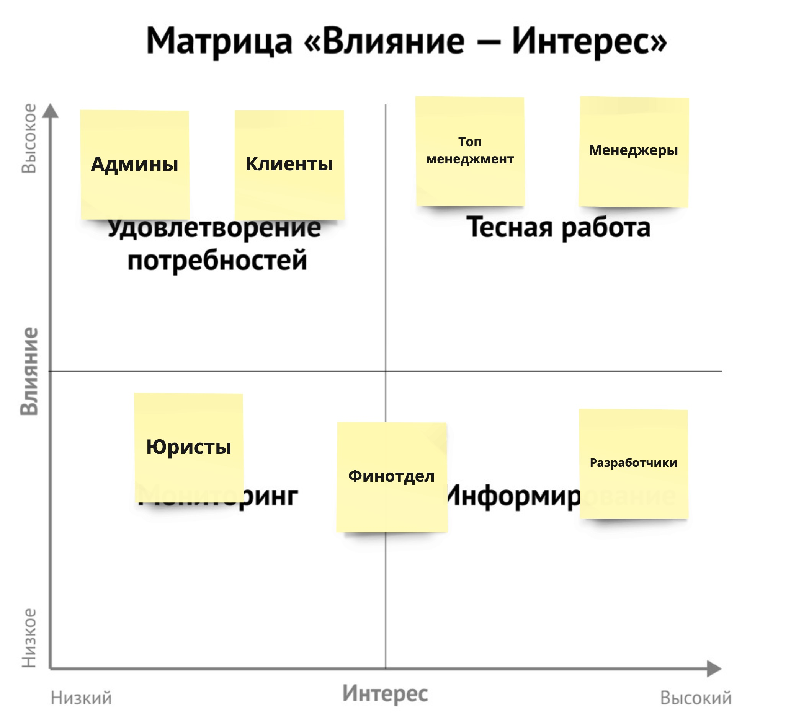
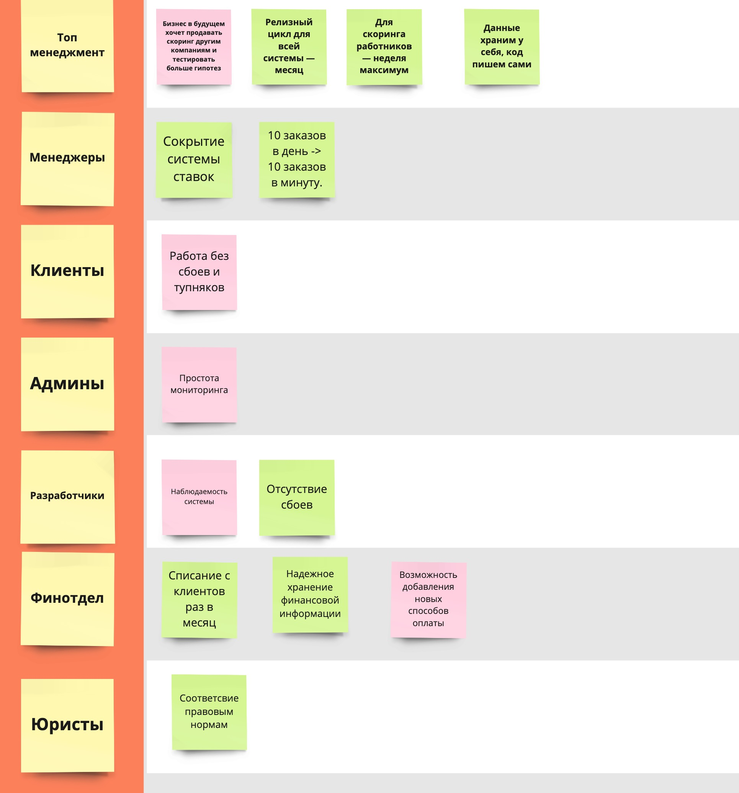
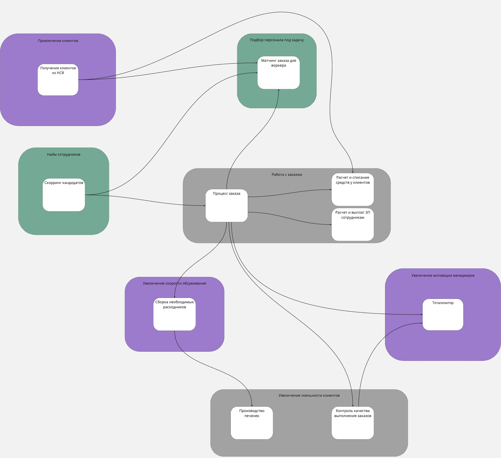
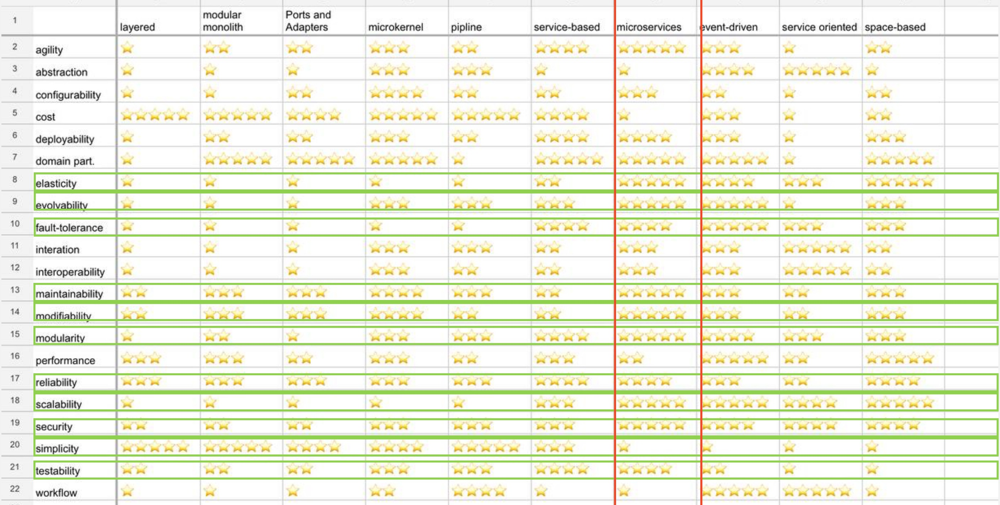
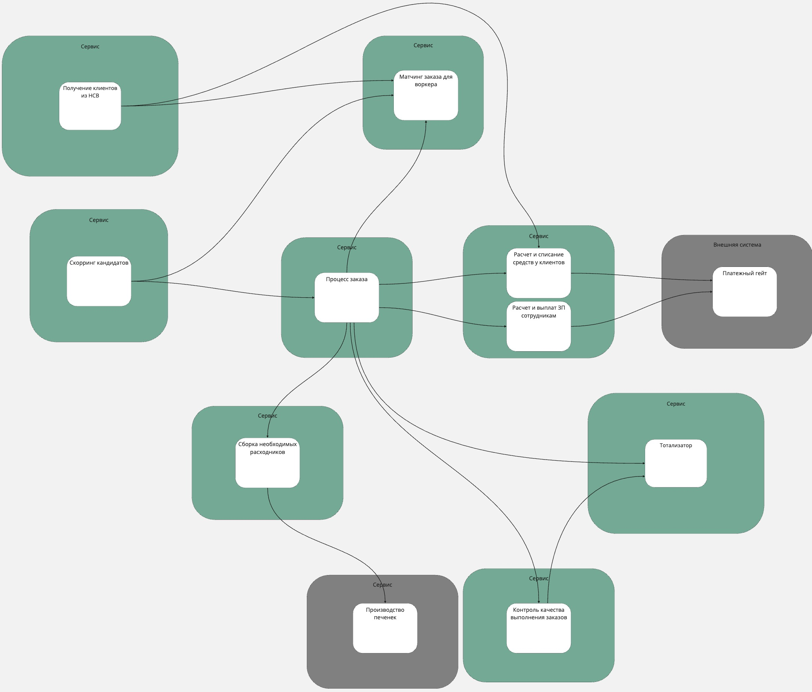
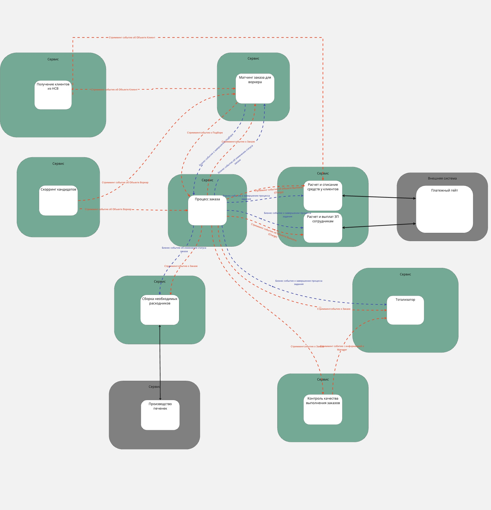

# Анализ систем

**Ссылка на [схемы](https://miro.com/app/board/uXjVK6sg_Jk=/?share_link_id=426027506670).**

**Группировка по группам**

Исходя из заданных стейкхолдеров, распределил их следующим образом.

Потенциальное расширение списка стейкхолдеров:

* **Воркеры**. Система довольно плотно работает с воркерами, они наравне с клиентами, являются активными пользователями нашей системы и их консерны будут важны для нас.
* **Работники склада. **Работники склада являются частью системы, при масштабировании системы, к примеру, на разные регионы, потребуется больше работников склада, в дальнейшем возможно выделение логистики, как отдельного домена.

Группировка стейкхолдеров и выделение важности конесернов.

Аналогично урокам, важные консеры - зеленые, неважные на данный момент - красные.

**Итоговая структура**

**Выбор архитектурного стиля для всей системы.**

Проанализируем характеристики

Важно обратить внимание на новые требования и консерны и требования по системе. Один из главных консернов топ-менеджеров - разный релизный цикл основных сервисов и сервиса скоринга работников, что говорит нам о конфликте характеристик. Это один из нескольких пунктов по которым итоговым архитектурным стилем выбираем - **микросервисы**.

Также в сторону микросервисов говорит, то, что нагрузка будет увеличиваться с ростом популярности системы. Один из консернов менеджеров - “10 заказов в день, а 10 заказов в минуту”, что говорит о высоком scalability для сервиса работы с заказом.

Тотализатор необходимо скрыть, спрятать, изолировать - выглядит как кандидат на отдельный сервис со своей бд.

Финансовая информация для соблюдения комплаенса должна хранится отдельно и желательно не теряться.

В итоге структура сервисов будет такой:

### **Определяем стили каждого полученного сервиса**

Выделим исключительные случаи:

1. Сервис “Матчинг заказа для воркера” . Согласно требованиям [US-300] алгоритм матчинга состоит из набора шагов в определенных последовательностях, в данном случае для сервиса выбираем тип **pipeline**. У данного стиля высокий показатель simplicity, modularity и workflow, что удовлетворяет заданным характеристикам.
2. Для сервисов “Расчет и списание средств у клиентов”  и “Расчет и выплат ЗП сотрудникам” выбран стиль microkernel. Сервисы оперирует финансовыми данными, данные будут хранится в рамках одной бд. Сервисы будут коммуницировать со внешними платежными системами через платежный шлюз, показалось уместным что разные плагины можно использовать как некие “адаптеры” к разным платежным системам для проведения финансовых операций. Для данного сервиса не нужен высокий уровень scalability, а по другим характеристикам как modularity и simplicity стиль нам подходит.

Для остальных сервисов выбираем монолитный стиль.

## **Выбираем вид базы данных**

* Для сервисов “Расчет и списание средств у клиентов”  и “Расчет и выплат ЗП сотрудникам” необходимо соблюдать финансовый комплайнс и комплаенс по хранению данных на своей стороне. Также важная высокая consistency, так как имеем дело с финансовыми транзакциями. Выбираем реляционную БД.
* Для сервиса “Контроля качества” и для анализа неструктурированных данных подойдет колоночная база данных.
* Для всех остальных сервисов выбираем реляционную БД с синхронизацией данных.

## **Определяем вид коммуникаций**

* Внешние системы обычно предоставляют rest api вследствие чего, для сервсов сборки расходников и биллинга будет использовать синхронные вызовы **request-response**.
* Для остальной части системы для внутренней коммуникации будем использовать **event-driven** и **common data** коммуникации.
* Два сервиса для биллинга, кроме как обращения во внешнюю систему будут иметь общие данные и обмениваться ими, это поможет держать финансовые данные в одном месте и тем самым соблюдать комплайнс.
* Для остальных сервисов системы выберем **event-driven **коммуникацию. Посредством стриминга бизнес событий и системный событий системы будут получать необходимую информацию в асинхронном стиле.

Результирующая система связей:

### 

## **Верифицируем (Фитнес функции)**

**Общие для всей системы (как референс берем java):**

Необходимое покрытие кода юнит тестами не менее 90% (junit, mockito)

Проведение end-to-end тестирования (Cypress).

Проверка качества кода и уязвимостей (sonarqube)

Контроль определения для событий через schema-registry

проверка периодичности релиза для системы скоринга не меньше недели, для остальной системы - месяц.

**Скоринг:**

Проведение нагрузочного тестирования (Gatling)

Проверка реализации архитектурного стиля. Чтобы понять, как это делать, узнать у разработчиков. Не получится автоматизировать — проверять вручную;

Анализ метрик coupling и cohesion. Решить, как проверять, с разработчиками.

**Процесс заказа:**

Проведение нагрузочного тестирования (Gatling)

**Расчет списания у Клиентов, Начисление ЗП сотрудникам:**

Проверка реализации архитектурного стиля. Чтобы понять, как это делать, узнать у разработчиков. Не получится автоматизировать — проверять вручную.

Аудит безопасности хранения данных.

# **ADR-001: Выбор архитектурного стиля для сервиса “Матчинг заказа для воркера”**

## **Context**

Основываясь на требованиях ([US-300]) бизнесу необходимо было иметь возможность конфигурировать и быстро менять матчинг, составляю его из изолированных шагов, следовательно есть потребность так же часто менять модели и алгоритмы. Отсуюда вытекают такие свойства как

* agility, testability и deployability - исходя из требований пр ТТМ
* scalability, modifiability, maintainability, testability, agility и evolvability - исходя из частоты изменений модели и алгоритма
* evolvability - возможность к изменениям контекста принятия решения

Из ограничений:

* Строгий комплайнс на хранение данных

## **Decision: Pipeline стиль**

Для поддержания на заданном уровне таких характеристик как scalability, modifiability, maintainability, testability, agility и evolvability  - был выбран Pipeline стиль. Ключевое - возможность строить цепочки для алгоритма матчинга.

## **Compliance**

Так как нет вариантов автоматической проверки реализации архитектурного стиля, то вся проверка будет делаться вручную посредством изучения проектной документации, кода и автоматически генерируемой карты сервисов, основанной на инструментах трассировки.
